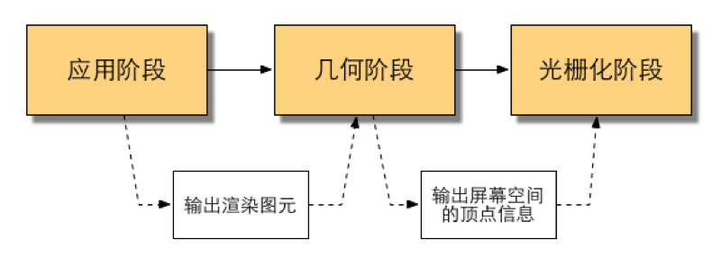
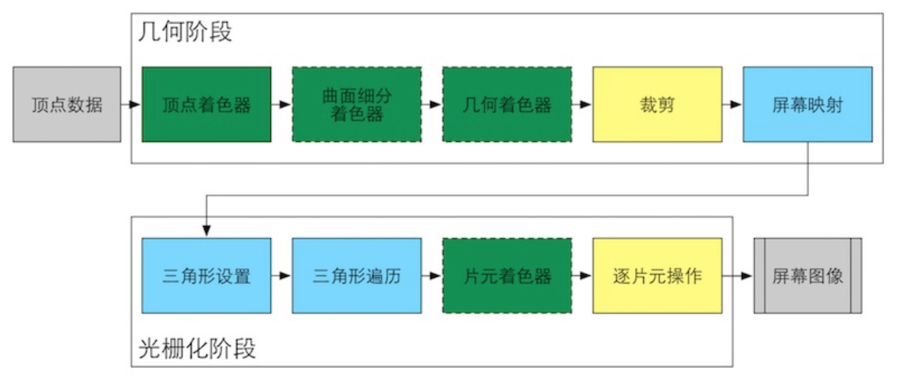
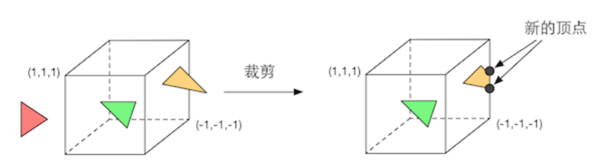
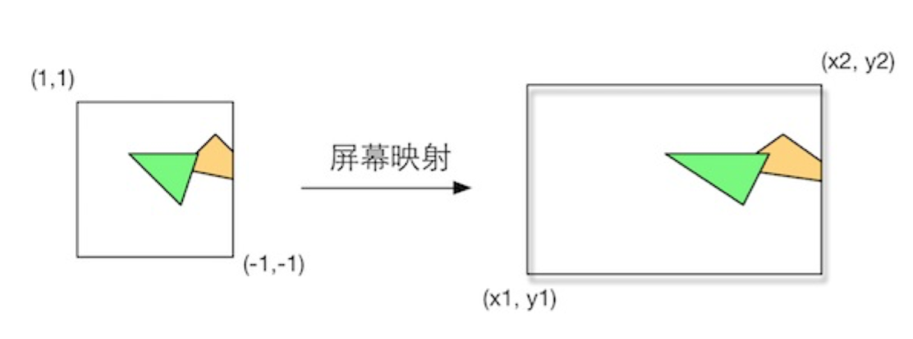
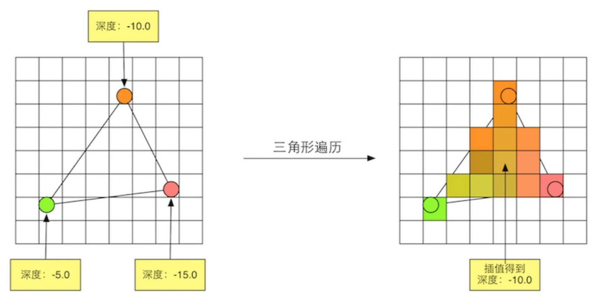
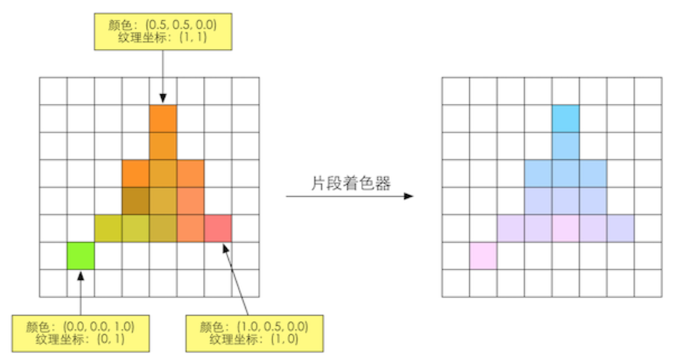
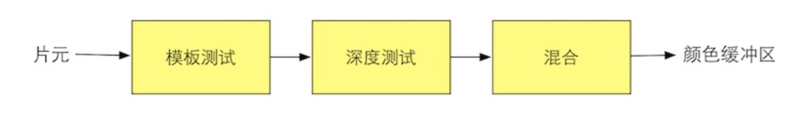

<!-- more -->

*\*本文为 Unity Shader 学习笔记和总结，主要参考[《Unity Shader入门精要》](https://github.com/candycat1992/Unity_Shaders_Book){:target="_blank"}和网络资料。*

##### 渲染流水线

渲染流水线的作用：有一个三维场景出发，生成一张二维图像。计算机需要从一系列的顶点数据、纹理等信息出发，把这些信息最终转换成一张人眼可以看到的图像。这个工作通常是由 CPU 和 GPU 共同完成的。

渲染流水线分为三个阶段：应用阶段、几何阶段、光栅化阶段。

{:width="500"}

###### 应用阶段（CPU 处理）

应用阶段是由我们的应用主导的，开发者具有绝对控制权。主要有 3 个任务：

1. 准备好场景数据，例如摄像机位置、视锥体、模型、光源等。

2. 粗粒度剔除工作，把不可见的物体剔除出去，提高渲染性能。

3. 设置好每个模型的渲染状态，包括使用的材质、使用的纹理、使用的 Shader 等。

这一阶段最重要的输出是渲染所需的几何信息，即**渲染图元**（点、线、面），传递给下一个阶段，几何阶段。

###### 几何阶段（GPU 处理）

几何阶段负责和每个渲染图元打交道，进行逐顶点、逐多边形的操作。该阶段的重要任务是把**顶点坐标转换到屏幕空间**中，再交给光栅器处理。通过对渲染图元进行处理后，将输出**屏幕空间的二维顶点坐标、每个顶点对应的深度值、着色**等信息，并传递给下一阶段。该阶段可以分为更小的流水线阶段。

###### 光栅化阶段（GPU 处理）

光栅化阶段使用几何阶段传递的数据来产生**屏幕上的像素**，并渲染出最终的图像。该阶段可以分为更小的流水线阶段。光栅化的任务主要是决定**每个渲染图元中的哪些像素应该被绘制在屏幕上**。

##### CPU 和 GPU 之间的通信

渲染流水线的起点是 CPU，即应用阶段。应用阶段大致可分为下面 3 个阶段：

###### 把数据加载到显存中

所有渲染所需的数据都需要从硬盘中加载到系统内存中，然后网格和纹理等数据又被加载到显卡上的存储空间——**显存**中。这是因为显卡对显存的访问速度更快，而且大多数显卡对系统内存没有直接的访问权利。数据加载到显存中之后，系统内存中的数据就可以移除了，但如果 CPU 需要这些数据来进行碰撞检测等，则系统内存里的数据就会保留。

###### 设置渲染状态

之后开发者需要通过 CPU 来设置渲染状态，指导 GPU 如何进行渲染工作。

渲染状态定义了场景中的网格是怎样被渲染的，例如使用的哪个顶点着色器 (Vertex Shader) 、片元着色器 (Fragment Shader)、光源属性、材质等。

###### 调用 Draw Call

Draw Call 是一个命令，它的发起者是 CPU，接收者是 GPU。一个 Draw Call 指向本次需要被渲染的图元列表。当给定一个 Draw Call 后，GPU 会根据渲染状态和所有的顶点数据来进行计算，最终输出成屏幕上显示的像素，这个计算过程，就是 GPU 流水线。

##### GPU 流水线

当 GPU 从 CPU 那里得到渲染命令后，就会进行一系列的流水线操作，最终把图元渲染到屏幕上。

几何阶段和光栅化阶段的实现载体是 GPU，开发者是无法完全控制这两个阶段的，但 GPU 向开发者开发了很多控制权。这个两个阶段可以分成很多更小的流水线阶段，这些流水线阶段由 GPU 来实现，每个阶段 GPU 提供了不同的可配置性或可编程性。

GPU 的渲染流水线实现。颜色表示了不同阶段的可配置性或可编程性：绿色表示该流水线阶段是**完全可编程控制的**，黄色表示该流水线阶段**可以配置但不是可编程的**，蓝色表示该流水线阶段是**由 GPU 固定实现的**，开发者没有任何控制权。实线表示**该 Shader 必须由开发者编程实现**，虚线表示**该 Shader 是可选的**。

##### 几何阶段

###### 顶点着色器

GPU 的渲染流水线接受**顶点数据**作为输入，这些顶点数据是由应用阶段加载到显存中的，再由 Draw Call 指定的。这些数据随后被传递到顶点着色器。顶点着色器是**完全可编程的**。

需要完成的任务：**顶点的坐标变换、逐顶点光照**等，还可以输出后续阶段所需的数据。

坐标变换：把顶点坐标**从模型空间转换到齐次裁剪空间**，可以改变顶点位置，实现顶点动画、模拟水面、布料等。

###### 曲面细分着色器

是一个可选的着色器，用于细分图元。

###### 几何着色器

是一个可选的着色器，用于执行逐图元的着色操作，或被用于产生更多的图元。

###### 裁剪

这一阶段是可配置的，目的是把哪些不在视野内的顶点裁剪掉，并剔除某些三角形图元的面片。

{:width="500"}

一个图元与摄像机视野的关系有 3 种：完全在视野内、部分在视野内、完全在视野外。 

完全在视野内的图元会继续传递给下一个流水线阶段，完全在视野外得图元不会继续向下传递，部分在视野内的图元需要做裁剪处理，使用一封信的顶点来代替。

###### 屏幕映射

这一阶段是不可配置和编程的，负责把每个图元的 x 和 y 坐标转换成**屏幕坐标（二维坐标系）**。

{:width="500"}

##### 光栅化阶段

上一阶段输出的信息是**屏幕坐标系下的顶点位置**以及相关的额外信息，如深度值（z 坐标）、法线方向、视角方向等。

光栅化阶段的重要目标是：**计算每个图元覆盖了哪些像素**和**为这些像素计算它们的颜色**。

###### 三角形设置

这一阶段，会计算光栅化一个三角网格所需的信息。上一阶段输出的是三角网格的顶点，如果我们想得到整个三角网格的覆盖情况，就必须计算每条边上的像素坐标而得到三角形边界的表示方式。这样一个计算**三角网格表示方式数据**的过程就是三角形设置。

###### 三角形遍历

这一阶段会检查每个像素是否被一个三角网格所覆盖。如果被覆盖的话，就会生成一个**片元**。根据上一阶段的计算结果来判断一个三角网格覆盖了哪些像素，并使用三角网格 3 个顶点的顶点信息对整个覆盖区域的像素进行**插值**。这样一个**找到哪些像素被三角网格覆盖**的过程就是三角形遍历。

一个**片元**并不是真正意义上的像素，而是包含了很多**状态的集合**，这些状态用于计算每个像素的最终颜色。这些状态包括了屏幕坐标、深度信息、及从几何阶段输出的顶点信息，如法线和纹理坐标等。

###### 片元着色器

**可编程**着色器阶段。

片元着色器的输入是上一个阶段对顶点信息**插值**得到的结果，输出是**一个或者多个颜色值**。这一阶段可以完成很多重要的渲染技术，其中最重要的技术之一就是**纹理采样**，需要在顶点着色器中输出每个顶点对应的纹理坐标。片元着色器可以完成很多重要的效果，但它仅可以影响单个片元。

###### 逐片元操作

输出合并阶段，高度可配置型阶段，主要任务有两个：

1. 决定每个片元的**可见性**。这涉及了很多测试工作，如**深度测试、模板测试**等。

2. 如果一个片元通过了所有的测试，就需要把这个片元的**颜色值**和已经存储在**颜色缓冲区中的颜色**进行合并，或者说是**混合**。

###### 屏幕图像

当模型的图元经过计算和测试后，就会显示到屏幕上。屏幕显示的就是颜色缓冲区中的颜色值。

##### OpenGL 和 DirectX

OpenGL 和 DirectX 是图形应用编程接口，用于渲染二维或三维图形。这些接口架起了上层应用程序和底层 GPU 的沟通桥梁。应用程序运行在 CPU 上，通过调用 OpenGL 或 DirectX 的图形接口将渲染所需的数据，如顶点数据、纹理数据、材质参数等数据存储在显存中的特定区域。随后，开发者可以通过图形编程接口发出渲染命令（Draw Call），它们将会被显卡驱动翻译成 GPU 能够理解的代码，进行真正的绘制。

##### Shader 开发语言

- HLSL: DirectX 的着色器语言，由**微软控制着色器的编译**。平台：微软自己的产品，如 Windows、Xbox 360等，这是因为在其他平台上没有可以编译 HLSL 的编译器。
- GLSL: OpenGL的着色器语言，优点在于跨平台性，可以在 Windows、Linux、Mac 甚至移动平台等多平台上工作，但这种跨平台性是由于 OpenGL 没有提供着色编译器，而是由**显卡驱动**来完成着色器的编译工作。也就是说，只要显卡驱动支持对 GLSL 的编译它就可以运行。
- CG：真正意义上的跨平台，它会根据平台的不同，编译成相应的中间语言。

