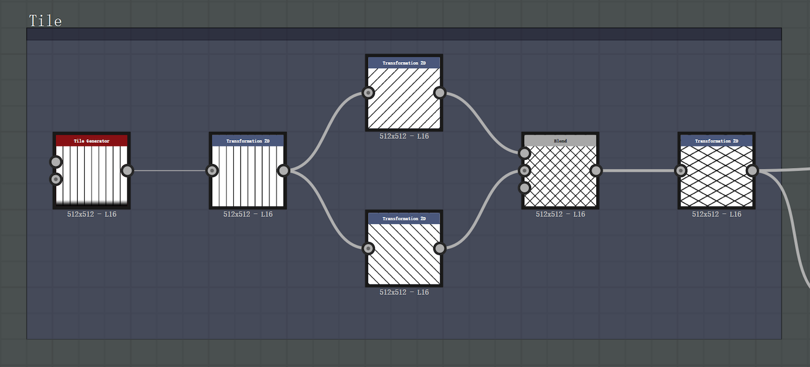
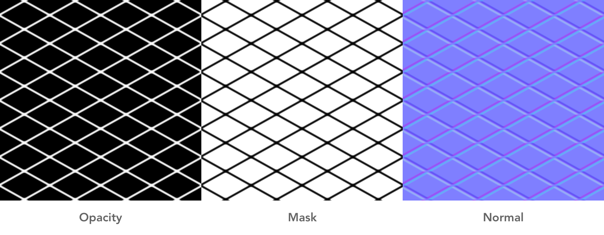
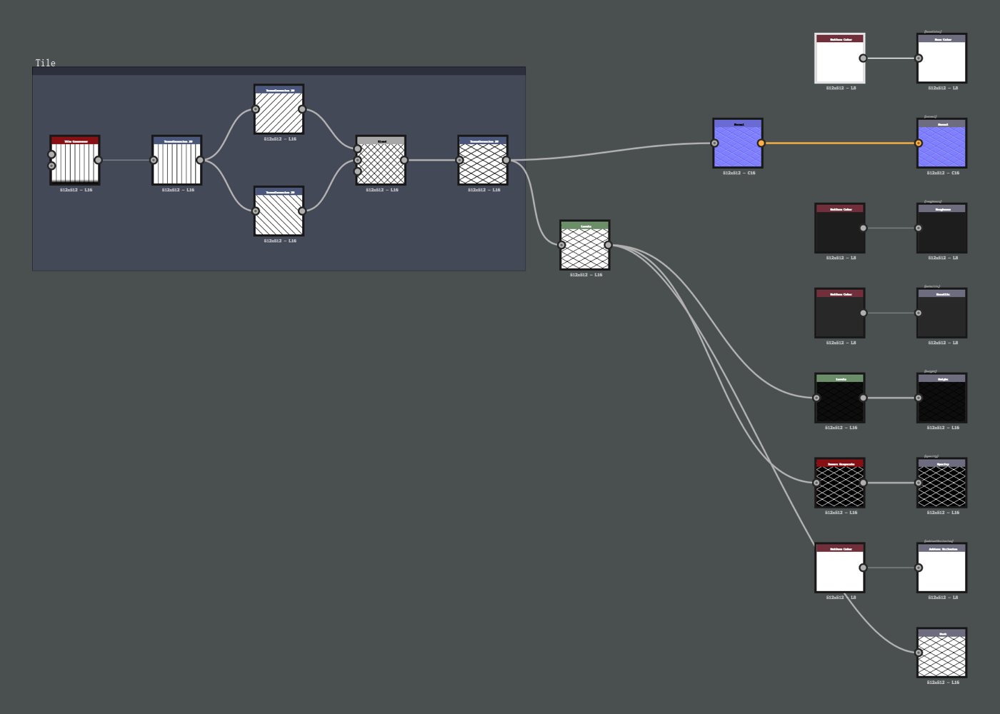
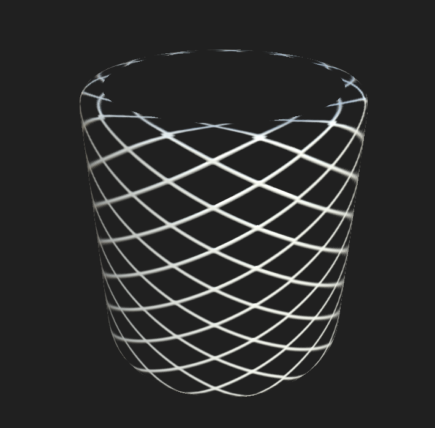
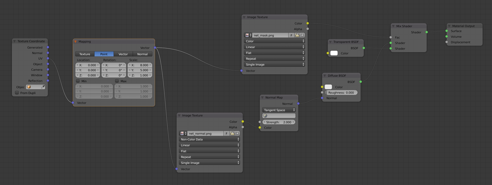
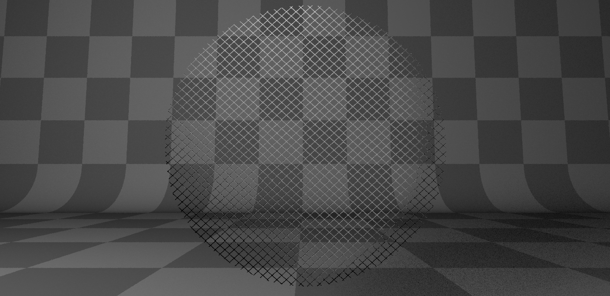

在学习 Blender 建模的时候思考怎么做一个网格置物桶，如果每一根铁丝都用多边形来表示，整个模型面数就会很高。为了增强渲染性能，最后使用带有透明通道的材质来实现，模拟出网格的效果。

<!-- more -->

##### Substance Designer 中制作纹理

首先是在 Substance Designer 中生成材质需要的纹理。网格的做法比较简单，两个分别旋转 45° 和 -45° 的条纹 Tile 进行颜色混合，使用正片叠底 Multiply 模式。最后稍微变形一下就完成了网格的基本形状。

{:target="_blank"}

关于 Outputs ，需要增加 Opacity 的输出贴图表示材质透明度，对上面完成的网格节点取反灰度即可得到。Mask 输出贴图用来在 Blender 中使用，为取反前的结果。还有常用的法线贴图用来模拟凹凸处光照效果。

[{:width="500px"}](../../images/post/blendernet/net_map.png){:target="_blank"}

节点全图如下：

{:target="_blank"}

在网格形状的 node 之后可以增加 Level node，调节网丝粗细。

3D View 中的效果图：

[{:width="300px"}](../../images/post/blendernet/net_view.png){:target="_blank"}

预览中我使用了圆角的圆柱体 (Rounded Cylinder) 作为预览的模型，发现只有前面是有网格的，看不到背面的纹理。猜测应该是渲染时使用了背面剔除。不过这没有关系，直接导出各项输出贴图即可。

#### Blender 中制作材质

在 Blender 里一般都选择 Cycles Renderer 作为渲染引擎，相对应的材质节点图如下：

{:target="_blank"}

用 Mix Shader 混合透明 Shader 和 Diffuse Shader，使用之前导出的 Mask 贴图作为因子。法线贴图连接到 Diffuse Shader 中的 Normal 输入。然后增加 Mapping 节点，纹理坐标的 UV 作为输入，来调整贴图的大小位置，即网格的密集度。

材质球预览：

[{:width="400px"}](../../images/post/blendernet/net_material.png){:target="_blank"}

此处的预览也是使用了背面剔除，看不到背面。但是将材质设置到模型中后进行渲染，两面都是可见的，而且阴影也很完美！

{:target="_blank"}

---

#### 参考链接

[Net Pattern Creation in Substance Designer 6](https://www.youtube.com/watch?v=9QHUAf5yO1c){:target="_blank"}