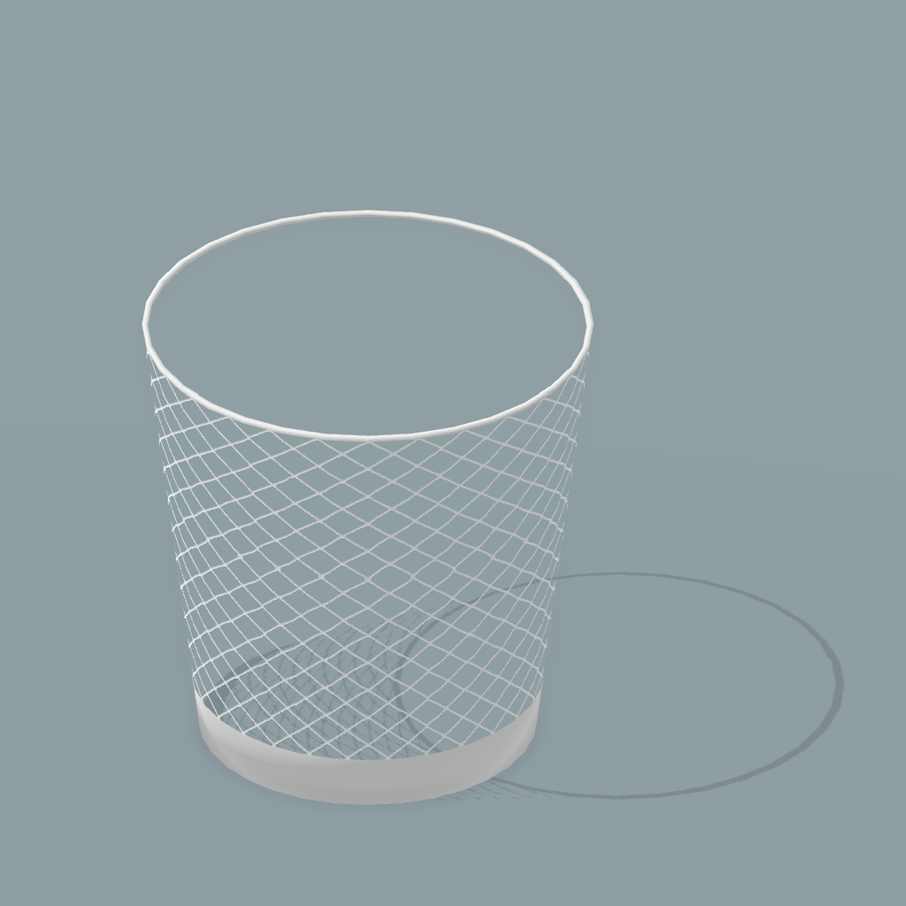
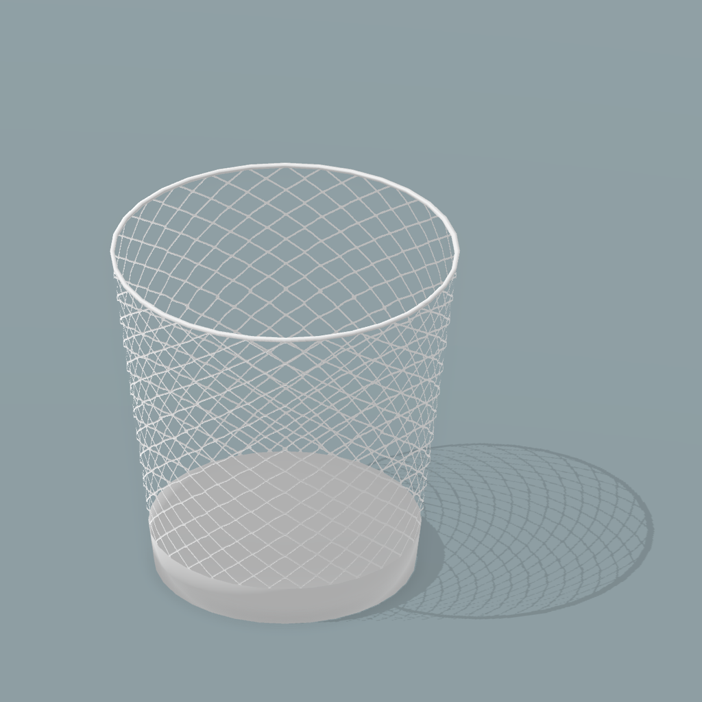

关于网格的材质，上一篇是在 Blender 中实现材质进行渲染的，这一篇学习 Unity Shader 中的透明测试和透明混合的方法，来实现透明的材质。


<!-- more -->


*\* 本文的着色器全部使用 Surface Shader 实现。Vertex & Fragment Shader 的写法也比较简单，可以自行尝试。*


---


##### 透明测试

因为使用了 Standard 光照模型，所以有 Glossiness ，Metallic 这些额外参数。

```
Shader "Custom/AlphaTest"
{
    Properties
    {
        _Color ("Color", Color) = (1, 1, 1, 1)

        _MainTex ("Main Texture", 2D) = "white" { }

        _AlphaTex ("Alpha Texture", 2D) = "white" { }
        _Cutoff ("Alpha Culloff", Range(0, 1)) = 0.5

        _BumpMap ("Normal Map", 2D) = "bump" { }
        _BumpScale ("Bump Scale", Float) = 1.0

        _Glossiness ("Smoothness", Range(0, 1)) = 0.5
        _Metallic ("Metallic", Range(0, 1)) = 0.0
    }
    SubShader
    {

        Tags { "Queue" = "AlphaTest" "IgnoreProjector" = "True" "RenderType" = "TransparentCutOut" }
        LOD 200
        
        CGPROGRAM
        
        #pragma surface surf Standard addshadow fullforwardshadows alphatest:_Cutoff

        #pragma target 3.0

        sampler2D _MainTex;
        sampler2D _AlphaTex;
        sampler2D _BumpMap;

        struct Input
        {
            float2 uv_MainTex;
            float2 uv_AlphaTex;
        };

        fixed4 _Color;
        float _BumpScale;
        float _Glossiness;
        float _Metallic;

        void surf(Input IN, inout SurfaceOutputStandard o)
        {
            fixed4 texColor = tex2D(_MainTex, IN.uv_MainTex);

            o.Albedo = texColor.rgb * _Color.rgb;
            o.Normal = UnpackNormal(tex2D(_BumpMap, IN.uv_AlphaTex)) * _BumpScale;
            o.Metallic = _Metallic;
            o.Smoothness = _Glossiness;
            o.Alpha = tex2D(_AlphaTex, IN.uv_AlphaTex).r;
        }
        ENDCG
        
    }
    FallBack "Transparent/Cutout/VertexLit"
}

```

设置渲染通道 `"Queue" = "AlphaTest"` 和渲染类型 `"RenderType" = "TransparentCutOut" `

编译指令需要增加 `alphatest:_Cutoff` 表示使用 Cutoff 作为判断透明的阈值，加上 `addshadow` 来生成正确的阴影投射。

surf 函数中对透明纹理进行采样  `o.Alpha = tex2D(_AlphaTex, IN.uv_AlphaTex).r;` 。

最后使用 `"Transparent/Cutout/VertexLit"` 作为 Fallback 。

如果 MainTex 和 AlphaTex 是相对应的，可以合并成一张纹理，减少内存占用。


效果：

[{:width="400px"}](../../images/post/unitynet/net_cull.png){:target="_blank"}

只渲染了正面，背面不可见，原因是默认着色器使用背面剔除，只需要取消剔除即可。`Cull` 有三个值可以选择： `Back` 背面剔除， `Front` 正面剔除， `Off` 取消剔除。

```
SubShader
{
	Tags { "Queue" = "AlphaTest" "IgnoreProjector" = "True" "RenderType" = "TransparentCutOut" }
	LOD 200
	
	Cull Off
        
    CGPROGRAM
    ...
}
```


同时在 Inspector 中需要将 Cast Shadow 选项设为 Two Sided 。


效果：

[{:width="400px"}](../../images/post/unitynet/net_nocull.png){:target="_blank"}

##### 透明混合

只需要修改几处代码：

修改渲染通道和渲染类型

`{"Queue"="Transparent" "IgnoreProjector"="True" "RenderType"="Transparent"}`

编译指令修改为

 `#pragma surface surf Standard addshadow fullforwardshadows alpha:blend` 

此时 ZWrite 深度写入修改无效，默认是 Off 。

或是

 `#pragma surface surf Standard addshadow fullforwardshadows keepalpha` 

此时需要制定混合模式 `Blend SrcAlpha OneMinusSrcAlpha` 并且关闭深度写入 `ZWrite Off` 。

> [半透明的物体为什么要关闭深度写入？](https://github.com/candycat1992/Unity_Shaders_Book/issues/153){:target="_blank"}
>
> **传统的半透明混合总是会在物体交叉、渲染重叠的情况下，出现错误的混合效果。如果开启深度写入，会令到渲染错误很明显，而关掉的话影响较小一点。**

最后 FallBack 制定 `"Transparent/VertexLit"`


---

##### 参考链接

[为什么半透明模型的渲染要使用深度测试而关闭深度写入？](https://www.zhihu.com/question/60898307/answer/182508073){:target="_blank"}

[编写表面着色器](http://www.ceeger.com/Components/SL-SurfaceShaders.html){:target="_blank"}