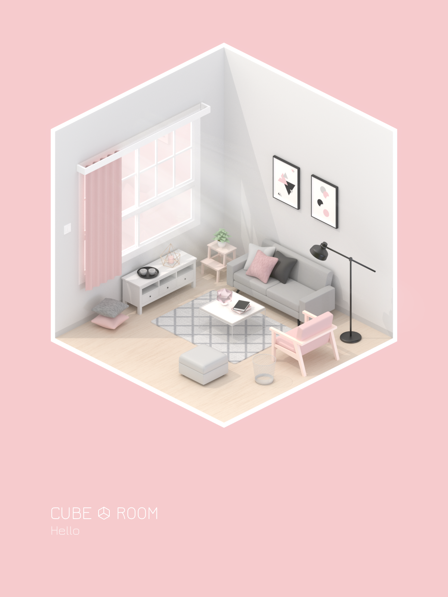
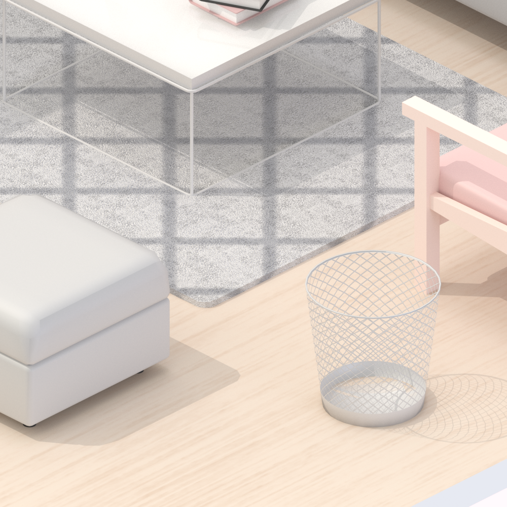

很早之前就想学建模了，花了一个月入门 Blender 和 Substance Designer 从建模到材质到渲染，完成了这第一个作品。

<!-- more -->

自《纪念碑谷》出现之后，isometric 风格就开始流行了起来，Dribbble 和 Pinterest 上也看到了很多这样的作品，我特别偏爱这种相对鲜明而卡通的渲染效果。身为一个模拟人生资深造房子玩家，一直思考如何在小小的空间中展示出可爱又精致的场景。在一个立方体中搭建室内效果，大概就是这个作品的初衷吧。

自学的过程主要是看 Youtube 上的视频，推荐 Blender Guru 的 [Blender Beginner Tutorial Series](https://www.youtube.com/playlist?list=PLjEaoINr3zgHs8uzT3yqe4iHGfkCmMJ0P&disable_polymer=true/) 。关于材质的制作，是无意中发现的一款很棒的软件 Substance Designer ，通过程序生成纹理来制作基于物理渲染的材质。而且 Youtube 上有官方视频教程，通过一个例子就能学习到基本使用方法了。

最满意的几个地方是蜡烛、植物和置物篮，因为花了很多时间去想怎么样做得更加精致，渲染出来的效果也很不错。但是灯光的布置并不完美，墙面的阴影显得略脏。一开始还打算在 Blender 中完成体积光，最后由于各种原因还是用 PS 实现的。

{:target="_blank"}

{:target="_blank"}

{:target="_blank"}