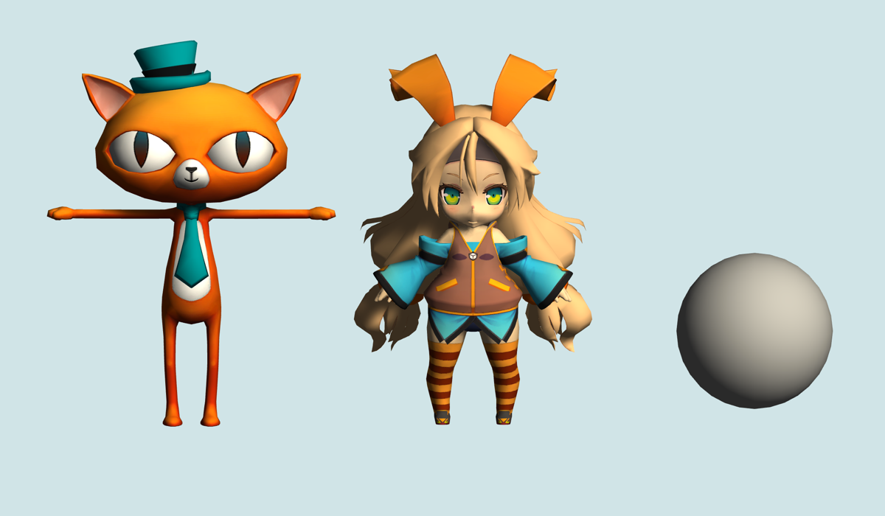
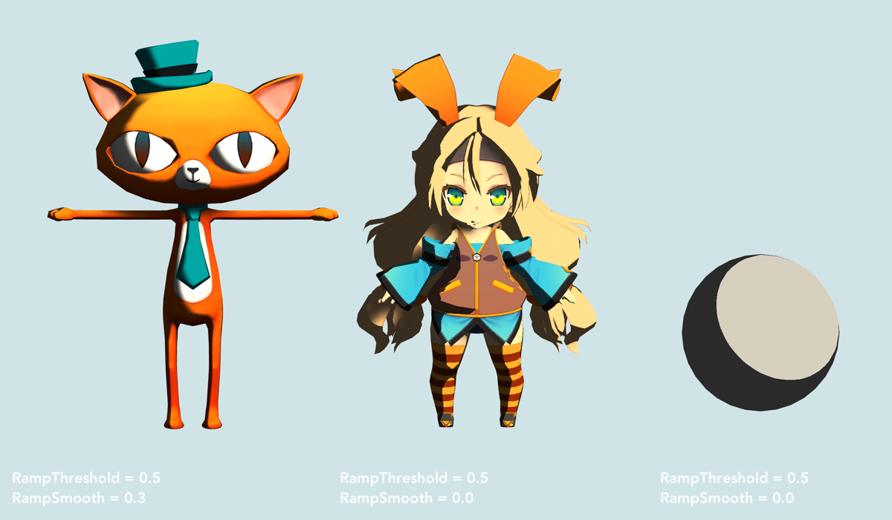
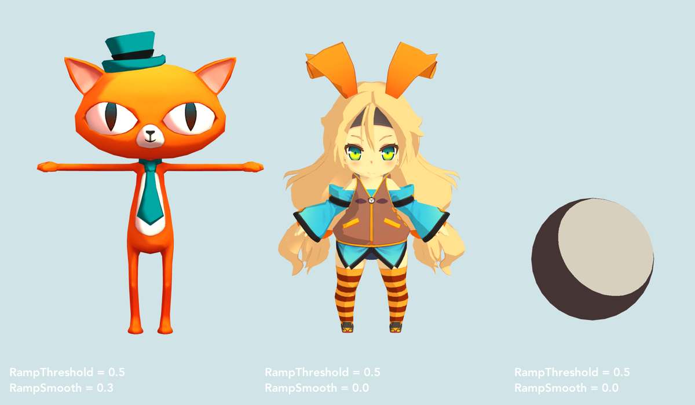
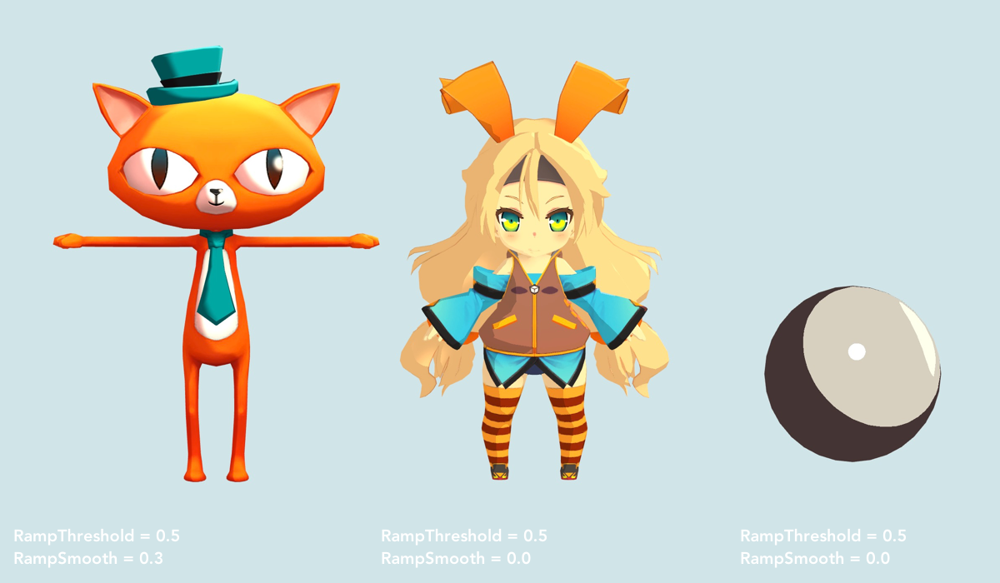
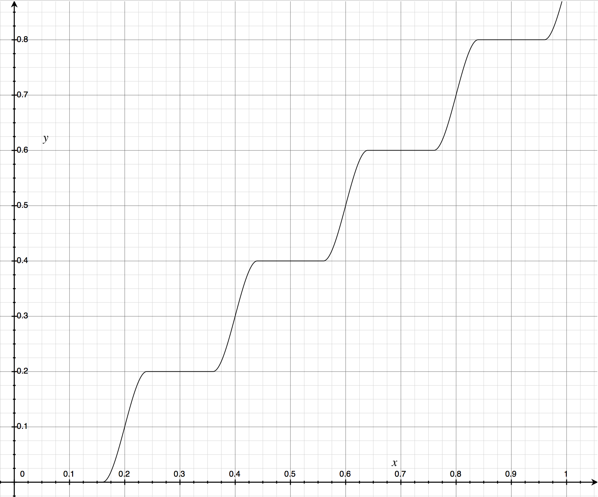
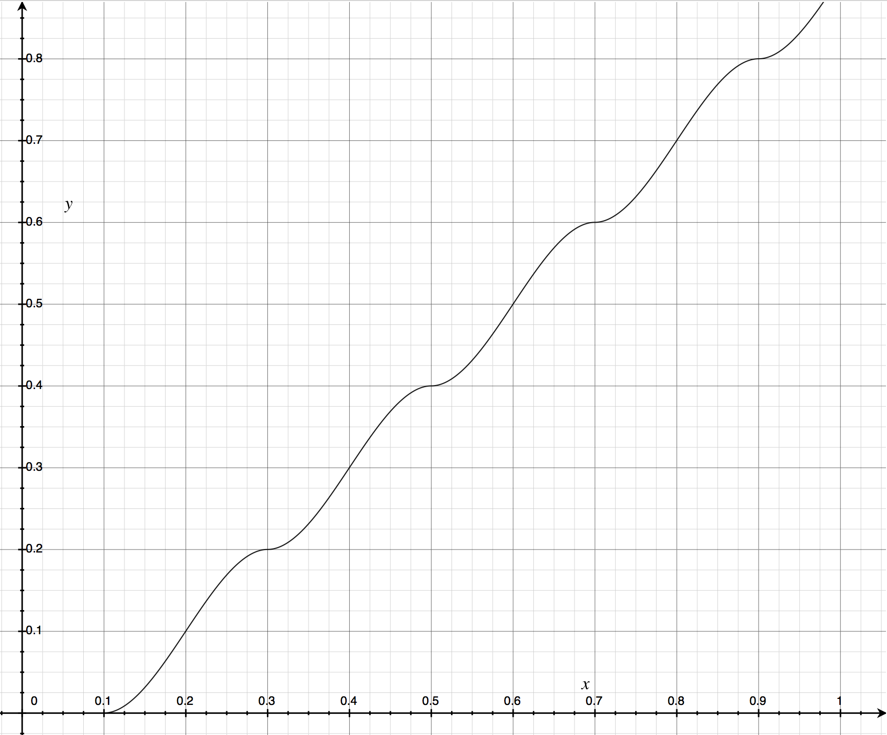
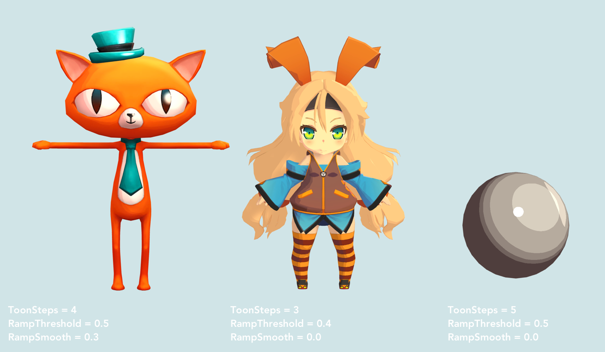

一直对非真实感渲染 (Non-Photorealistic Rendering) 很感兴趣，正好发现某社出的新游戏中可以选择真实质感或卡通质感，所以想试试在 Unity 里实现一下卡通着色器。


<!-- more -->

卡通渲染最关键的特征包括不同于真实感渲染的**艺术化光影效果**和**轮廓描边**。光影效果即是指将物体受光照的颜色从多色阶降到低色阶，减少颜色的丰富程度。本篇即讨论如何卡通着色，实现该光影效果。


*\* 本文主要参考 Unity Assets Store 中的 [Toony Colors Pro 2](https://assetstore.unity.com/packages/vfx/shaders/toony-colors-pro-2-8105){:target="_blank"} ，模型也来自该工具包。着色器全部使用 Surface Shader 实现。*

Github: [github.com/Sorumi/UnityToonShader](https://github.com/Sorumi/UnityToonShader){:target="_blank"}

---

首先搭一下基本的着色器框架，在 Surface Shader 中自定义光照模型 LightingToon，编译指令中排除多余的渲染路径通道，减少最终生成 shader 的体积。

```
Properties
{
	_Color ("Color", Color) = (1, 1, 1, 1)
	_MainTex ("Main Texture", 2D) = "white" { }
}

SubShader
{
	Tags { "RenderType" = "Opaque" }
        
	CGPROGRAM
        
	#pragma surface surf Toon addshadow fullforwardshadows exclude_path:deferred exclude_path:prepass
	#pragma target 3.0
        
	fixed4 _Color;
	sampler2D _MainTex;

	struct Input
	{
		float2 uv_MainTex;
		float3 viewDir;
	};

	inline fixed4 LightingToon(SurfaceOutput s, half3 lightDir, half3 viewDir, half atten)
	{
		half3 normalDir = normalize(s.Normal);
		float ndl = max(0, dot(normalDir, lightDir));

		fixed3 lightColor = _LightColor0.rgb;
            
		fixed4 color;
		fixed3 diffuse = s.Albedo * lightColor * ndl * atten;
            
		color.rgb = diffuse;
		color.a = s.Alpha;
		return color;
	}
        
	void surf(Input IN, inout SurfaceOutput o)
	{
		fixed4 mainTex = tex2D(_MainTex, IN.uv_MainTex);
		o.Albedo = mainTex.rgb * _Color.rgb;

		o.Alpha = mainTex.a * _Color.a;
	}

	ENDCG
}

```

这是非卡通渲染只有环境光照 (ambient) 和漫反射 (diffuse) 的效果。

[](../../images/post/toonshader/Toon_1_No.png){:target="_blank"}


##### 简化颜色

实现原理是把 diffuse 漫反射颜色简化成对比较明显的几个色阶，首先尝试一下降到 2 阶色阶。Diffuse 模型中，法线方向向量与光线方向向量的点积控制着漫反射的强度。

`float ndl = max(0, dot(normalDir, lightDir));`

​设置属性：RampThreshold 色阶阈值，ndl >= threshold 时 ramp = 1， ndl < threshold 时 ramp = 0。但是这样会导致分界线十分明显，所以再增加属性：RampSmooth 色阶间平滑度。使用 smoothstep 平滑函数，根据 RampSmooth 对色阶之间进行过渡。

```
fixed3 ramp = smoothstep(_RampThreshold - _RampSmooth * 0.5, _RampThreshold + _RampSmooth * 0.5, ndl);
ramp *= atten;
...
fixed3 diffuse = s.Albedo * lightColor * ramp;
```

[](../../images/post/toonshader/Toon_2_Ramp.png){:target="_blank"}

可以看到光影对比很明显了，但是这个阴影也太丑了，所以直接用颜色叠加作为阴影和高光。设置属性 HColor 高光颜色和 SColor 阴影颜色。

```
_SColor = lerp(_HColor, _SColor, _SColor.a);
float3 rampColor = lerp(_SColor.rgb, _HColor.rgb, ramp);
...
fixed3 diffuse = s.Albedo * lightColor * rampColor;
```

[](../../images/post/toonshader/Toon_3_Color.png){:target="_blank"}

画面一下子就变得干净了，看起来舒服多啦~


##### 增加镜面高光和边缘光

之后再做一些增强画面效果的工作，首先设置镜面光照的相关属性：SpecColor 高光颜色、SpecSmooth 高光色阶的平滑度、Shininess 镜面反射度。

surf 着色器里，使用纹理的 alpha 通道作为光泽度 Gloss 。

```
void surf(Input IN, inout SurfaceOutput o)
{
	...     
	o.Specular = _Shininess;
	o.Gloss = mainTex.a;
}
```


```
inline fixed4 LightingToon(SurfaceOutput s, half3 lightDir, half3 viewDir, half atten)
{
	half3 halfDir = normalize(lightDir + viewDir);
	...
	float ndh = max(0, dot(normalDir, halfDir));
	...            
	float spec = pow(ndh, s.Specular * 128.0) * s.Gloss;
	spec *= atten;
	spec = smoothstep(0.5 - _SpecSmooth * 0.5, 0.5 + _SpecSmooth * 0.5, spec);
	...
	fixed3 specular = _SpecColor.rgb * lightColor * spec;

	color.rgb = diffuse + specular;
	color.a = s.Alpha;
	return color;
}
```

设置边缘光的属性：RimColor 边缘光颜色、RimThreshold 边缘光阈值、RimSmooth 边缘光色阶的平滑度。法线方向与视线方向夹角越小，与光线方向夹角越大，则边缘光强度越强。

```
inline fixed4 LightingToon(SurfaceOutput s, half3 lightDir, half3 viewDir, half atten)
{
	...
	float ndv = max(0, dot(normalDir, viewDir));
	...
	float rim = (1.0 - ndv) * ndl;
	rim *= atten;
	rim = smoothstep(_RimThreshold - _RimSmooth * 0.5, _RimThreshold + _RimSmooth * 0.5, rim);
	...
	fixed3 rimColor = _RimColor.rgb * lightColor * _RimColor.a * rim;

	color.rgb = diffuse + specular + rimColor;
	color.a = s.Alpha;
	return color;
}          
```

[](../../images/post/toonshader/Toon_4_SpecularAndRim.png){:target="_blank"}


##### 阴影纹理

对于模型不同部分，单纯用颜色来做阴影可能缺少层次感，可以考虑使用纹理，对不同部分添加不同的阴影颜色。这里需要自定义 SurfaceOutput ，添加 Shadow 保存纹理采样的颜色。

```
void surf(Input IN, inout SurfaceOutputCustom o)
{
	...
	fixed4 shadowTex = tex2D(_ShadowTex, IN.uv_MainTex);
	o.Shadow = shadowTex.rgb;
	...
}

inline fixed4 LightingToon(SurfaceOutputCustom s, half3 lightDir, half3 viewDir, half atten)
{
	...
	s.Albedo = lerp(s.Shadow, s.Albedo, ramp);
	...
}
```


##### 多阶色阶

一般，多阶色阶是由美术制作一维色彩表的纹理，对其进行采样获得颜色值。现在来考虑一下用程序来实现。

同样使用 RampThreshold 控制光影的比例。

`float diff = smoothstep(_RampThreshold - ndl, _RampThreshold + ndl, ndl);`

增加属性 ToonSteps 表示色阶层数。

`float ramp = floor(diff * _ToonSteps) / _ToonSteps;`

色阶之间需要根据 RampSmooth 平滑过渡，首先来看一下一直使用的 smoothstep 函数。

> smoothstep(float **min**, float **max**, float **t**);
>
> 根据 t , min 和 max ，返回在 0 到 1 之间的一个数，类似于插值函数 lerp 。但是 lerp 是线性，而 smoothstep 在 min 和 max 处增长缓慢，中间增长较快。

如果 ToonSteps = 5 ，则 ramp 关于 diff 的函数图像为

[](../../images/post/toonshader/Ramp_1.png){:target="_blank"}

```
float interval = 1 / _ToonSteps;
float level = round(diff * _ToonSteps) / _ToonSteps;
ramp = interval * smoothstep(level - _RampSmooth * interval * 0.5, level + _RampSmooth * interval * 0.5, diff) + level - interval;
ramp = max(0, ramp);
ramp *= atten;
```

但是当 RampSmooth = 1 ，即完全平滑，图像应该是线性的，但是函数图像如下图

[](../../images/post/toonshader/Ramp_2.png){:target="_blank"}

为了修正这一点，暂时的做法是加了一个判断

```
float linearstep(float min, float max, float t)
{
	return saturate((t - min) / (max - min));
}

inline fixed4 LightingToon(SurfaceOutput s, half3 lightDir, half3 viewDir, half atten)
{
	...
	if (_RampSmooth == 1)
	{
		ramp = interval * linearstep(level - _RampSmooth * interval * 0.5, level + _RampSmooth * interval * 0.5, diff) + level - interval;
	}
	else
	{
		ramp = interval * smoothstep(level - _RampSmooth * interval * 0.5, level + _RampSmooth * interval * 0.5, diff) + level - interval;
	}
	...
}
```


效果：

[](../../images/post/toonshader/Toon_5_Multisteps.png){:target="_blank"}

---

##### 参考链接

[Toony Colors Pro 2](https://assetstore.unity.com/packages/vfx/shaders/toony-colors-pro-2-8105){:target="_blank"}

[卡通渲染及其相关技术总结](https://blog.uwa4d.com/archives/usparkle_cartoonshading.html){:target="_blank"}

[Unity3d shader之卡通着色Toon Shading](https://blog.csdn.net/wolf96/article/details/43019719){:target="_blank"}