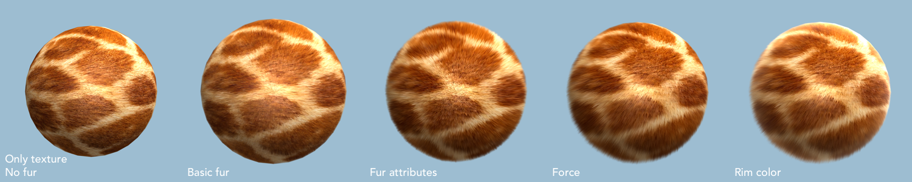
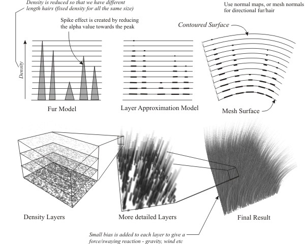
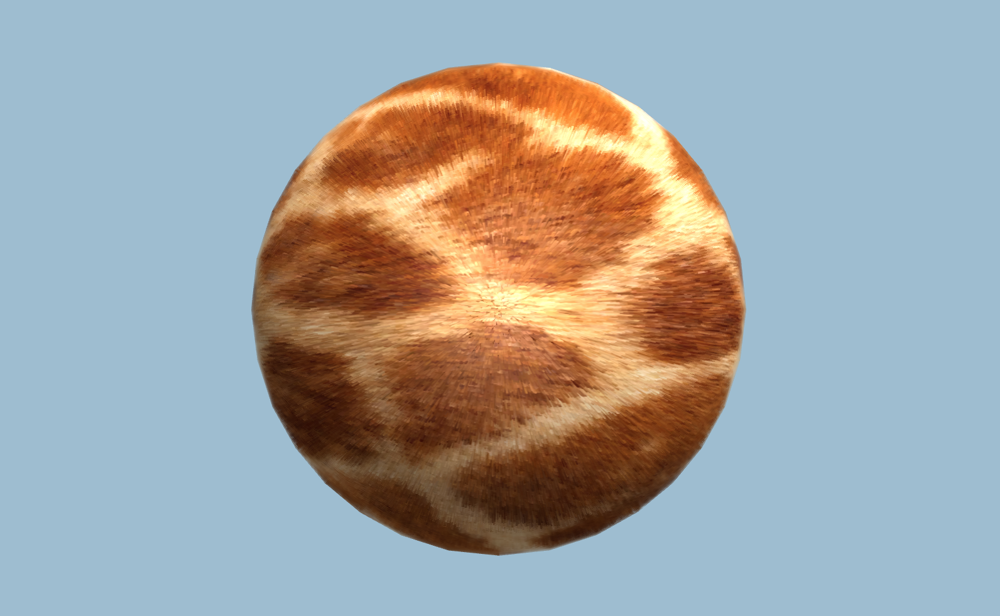
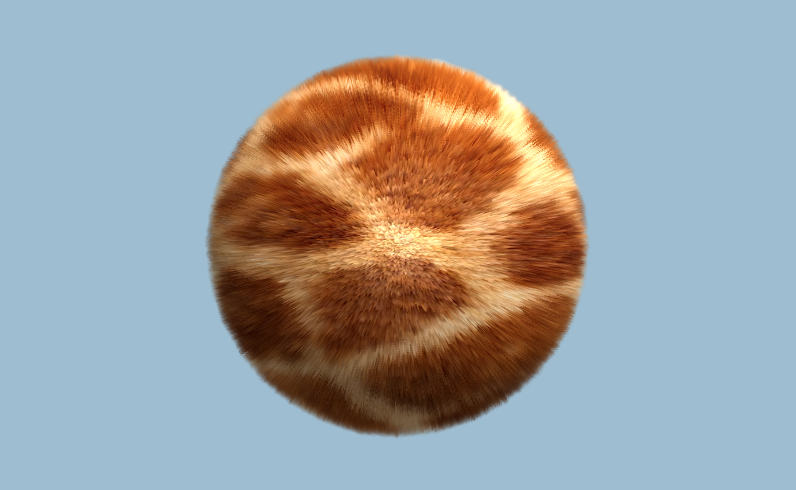
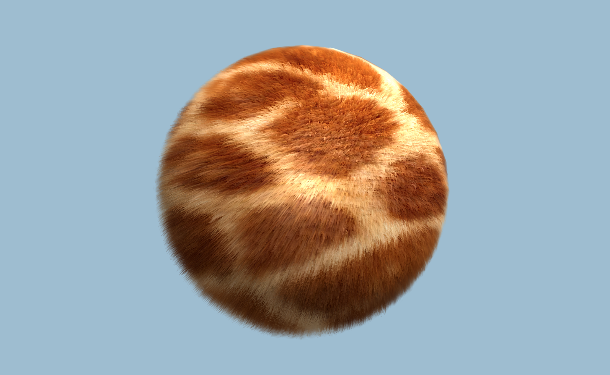
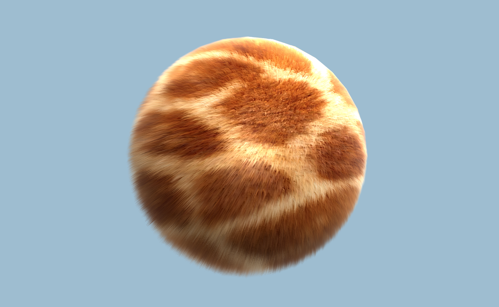

<!-- more -->

[](../../images/post/furshader/Intro.png){:target="_blank"}


Github: [github.com/Sorumi/UnityFurShader](https://github.com/Sorumi/UnityFurShader){:target="_blank"}


##### 基础皮毛 [0.1 Basic](https://github.com/Sorumi/UnityFurShader/tree/master/Assets/Shaders/Fur_0_1_Basic){:target="_blank"}

首先建立毛发的模型。

[](../../images/post/furshader/Fur_Model.jpg){:target="_blank"}

根据模型，我们使用层 (layer) 来渲染毛发长度，在 Unity Shader 中，每一个 Pass 即表示一层。
当渲染每一层时，使用法线将顶点位置”挤出“模型表面，则对应的像素点位置的公式：

`float3 P = v.vertex.xyz + v.normal * _FurLength * FURSTEP;`

`FURSTEP` 表示当前层数 / 总层数，增加层数可以创造更精细毛发。

然后使用一张噪波纹理作为每个像素点的 alpha 值，来判断该像素点是不是属于毛发的点。

光照模型则使用了环境光照 (ambient)、漫反射光照 (diffuse)、镜面光照 (specular) ，并采用逐像素着色。（如果考虑性能的话，可以改成逐顶点着色。）

如果设置 n 层，在 SubShader 中需要有不考虑毛发只渲染表面的 1 个 Pass ，和渲染毛发的 n 个 Pass，共 n + 1 个 Pass。

毛发 Pass 中的代码：

```
struct v2f
{
    float4 pos: SV_POSITION;
    half4 uv: TEXCOORD0;
    float3 worldNormal: TEXCOORD1;
    float3 worldPos: TEXCOORD2;
};

v2f vert_base(appdata_base v)
{
    v2f o;
    float3 P = v.vertex.xyz + v.normal * _FurLength * FURSTEP;
    o.pos = UnityObjectToClipPos(float4(P, 1.0));
    o.uv.xy = TRANSFORM_TEX(v.texcoord, _MainTex);
    o.uv.zw = TRANSFORM_TEX(v.texcoord, _FurTex);

    o.worldNormal = UnityObjectToWorldNormal(v.normal);
    o.worldPos = mul(unity_ObjectToWorld, v.vertex).xyz;
    
    return o;
}

fixed4 frag_base(v2f i): SV_Target
{
    fixed3 worldNormal = normalize(i.worldNormal);
    fixed3 worldLight = normalize(_WorldSpaceLightPos0.xyz);
    fixed3 worldView = normalize(_WorldSpaceCameraPos.xyz - i.worldPos.xyz);
    fixed3 worldHalf = normalize(worldView + worldLight);

    fixed3 albedo = tex2D(_MainTex, i.uv.xy).rgb * _Color;
    fixed3 ambient = UNITY_LIGHTMODEL_AMBIENT.xyz * albedo;
    fixed3 diffuse = _LightColor0.rgb * albedo * saturate(dot(worldNormal, worldLight));
    fixed3 specular = _LightColor0.rgb * _Specular.rgb * pow(saturate(dot(worldNormal, worldHalf)), _Shininess);
    
    fixed3 color = ambient + diffuse + specular;
    fixed alpha = tex2D(_FurTex, i.uv.zw).rgb;
    
    return fixed4(color, alpha);
}
```


效果：
[](../../images/post/furshader/Fur_0_1_Basic.png){:target="_blank"}


##### 皮毛属性 [0.2 Attributes](https://github.com/Sorumi/UnityFurShader/tree/master/Assets/Shaders/Fur_0_2_Attributes){:target="_blank"}

###### 增加毛发强度 (fur density)

用来表现毛发越到尾部越细，越少。根据 noise 灰度图采样调整每一层像素的透明度，修改 fragment shader 中的 alpha 计算方法

` alpha = clamp(noise - (FURSTEP * FURSTEP) * _EdgeFade, 0, 1);`

###### 增加毛发细度 (fur thinness)

本质上是改变 noise texture 的 tile

`fixed3 noise = tex2D(_FurTex, i.uv.zw * _FurThinnesss).rgb;`

###### 增加毛发阴影 (fur shading)

毛发越靠近根部的像素点颜色越暗

`albedo -= (pow(1 - FURSTEP, 3)) * _FurShading;`

或使用插值的方式

`float shadow = lerp(1, FURSTEP, _FurShading);`

`albedo *= shadow;`

对比了两种方式的效果，感觉上一种更有层次感。

效果：
[](../../images/post/furshader/Fur_0_2_Attributes.png){:target="_blank"}


##### 增加外力 [0.3 Force](https://github.com/Sorumi/UnityFurShader/tree/master/Assets/Shaders/Fur_0_3_Force){:target="_blank"}

分为相对于 world 的作用力 (force global) 和相对于 object 的作用力 (force local) ，在 vertex shader 中修改顶点位置 P ，使用 clamp(x, -1, 1) 函数，对偏移方向进行约束。

`P += clamp(mul(unity_WorldToObject, _ForceGlobal).xyz + _ForceLocal.xyz, -1, 1) * pow(FURSTEP, 3) * _FurLength;`

效果：
[](../../images/post/furshader/Fur_0_3_Force.png){:target="_blank"}


##### 边缘颜色 [0.4 Rim Color](https://github.com/Sorumi/UnityFurShader/tree/master/Assets/Shaders/Fur_0_4_RimColor){:target="_blank"}

考虑到毛发在边缘的颜色会略微受光的影响，增加边缘颜色 (rim color)

`half rim = 1.0 - saturate(dot(worldView, worldNormal));`

`albedo += fixed4(_RimColor.rgb * pow(rim, _RimPower), 1.0);`

效果：
[](../../images/post/furshader/Fur_0_4_RimColor.png){:target="_blank"}


##### TODO

- PBR Fur Shader

---

##### 参考链接

[Fur Effects - Teddies, Cats, Hair ....](http://www.xbdev.net/directx3dx/specialX/Fur/index.php){:target="_blank"}

[Fur shader - Shaders Laboratory](http://www.shaderslab.com/demo-60---fur-shader.html){:target="_blank"}

