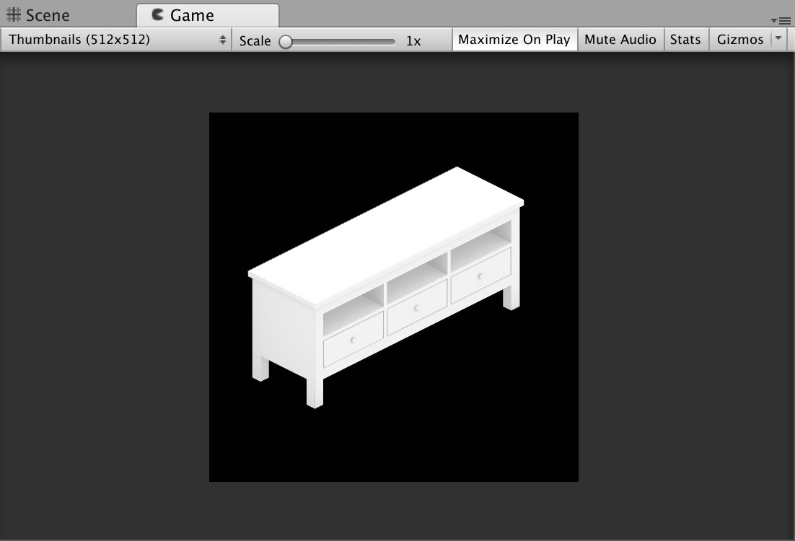
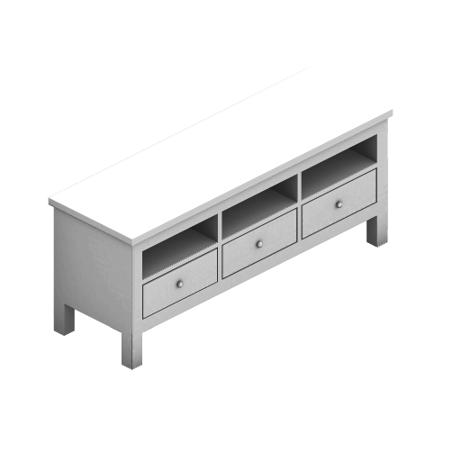
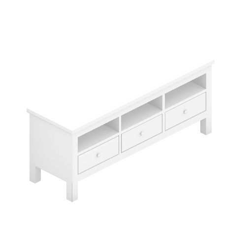

CubeRoom 开发小记。

CubeRoom 中有一个功能是列表展示每个物件，实时渲染缩略图的代价太高了，因此考虑为每个物件生成透明背景截图。

<!-- more -->

在 Google 上找到了 [Render screenshots with transparent backgrounds from Unity3D](https://medium.com/@mormo_music/render-screenshots-with-transparent-backgrounds-from-unity3d-free-version-dc098c5bbba2){:target="_blank"} 这篇文章，作者使用了将 Game 窗口的截图即 MainCamera 的视图写入到 Texture2D 纹理中，但是截图一定会带有背景色。该作者的解决方法是分别生成黑色背景和白色背景的截图，再计算两张图像素颜色的区别，生成透明背景的图片。

使用了该脚本后发现导出的图片和实际在 Game 窗口中的画面存在一定色差，而且该方法计算透明像素时，对边缘没有进行处理，锯齿肉眼可见。

Game 窗口：

[{:width="500"}](../../images/post/rendertexture/game.png){:target="_blank"}

生成缩略图：

[{:width="300"}](../../images/post/rendertexture/output_1.png){:target="_blank"}

看文档时发现了一种特殊的纹理 [Unity - Manual: Render Texture](https://docs.unity3d.com/Manual/class-RenderTexture.html){:target="_blank"} ，可以连接到某个 Camera 的 Target Texture 属性，来获得该摄像机的视图。如果该摄像机的背景色为透明时，生成的纹理是带有透明通道的。

GitHub: [TransparentBackgroundScreenshotRecorder.cs](https://gist.github.com/Sorumi/1584b2e97648b9568f47585365718e38){:target="_blank"}

##### 使用步骤

- 创建新的 Camera 用来生成纹理获取视图，调整位置和角度。如果想要得到的图片和 Game 窗口的视图相同，可以直接复制 MainCamera 作为渲染摄像机。
- 创建 RenderTexture ，并设置为 Camera 的 Target Texture 属性。
- 设置渲染摄像机的 Clear Flags 为 Solid Color ，如果需要透明背景将 Background 的透明通道设为 0 。
- 将 [TransparentBackgroundScreenshotRecorder.cs](https://gist.github.com/Sorumi/1584b2e97648b9568f47585365718e38){:target="_blank"} 脚本添加到渲染摄像机上。Frame Rate 表示每秒的帧率，Frames To Capture 表示需要生成的图片数。第一帧的图片可能为空白，Frames To Capture 最好大于 1 。
- 选择 Game 窗口的屏幕分辨率，与 RenderTexture 的 Size 一致，即为生成图片的分辨率。
- 点击 Play ！
- 默认导出的图片在项目的 ScreenShots 目录下。

如果存在**色差**，可能是 RenderTexture 颜色空间的问题，需要勾选 RenderTexture 的 **sRGB** 选项

生成缩略图：

[{:width="300"}](../../images/post/rendertexture/output_2.png){:target="_blank"}

##### 更新

关于存在的色差是由于 Gamma 矫正，如果在 Unity 中选择 linear space 线性空间，需要勾选 sRGB 选项。

---

##### 延伸阅读

[Unity3d 中渲染到 RenderTexture 的原理](https://blog.csdn.net/leonwei/article/details/54972653){:target="_blank"}

##### 参考链接

[Render screenshots with transparent backgrounds from Unity3D](https://medium.com/@mormo_music/render-screenshots-with-transparent-backgrounds-from-unity3d-free-version-dc098c5bbba2){:target="_blank"}

[Unity - Manual: Render Texture](https://docs.unity3d.com/Manual/class-RenderTexture.html){:target="_blank"}

