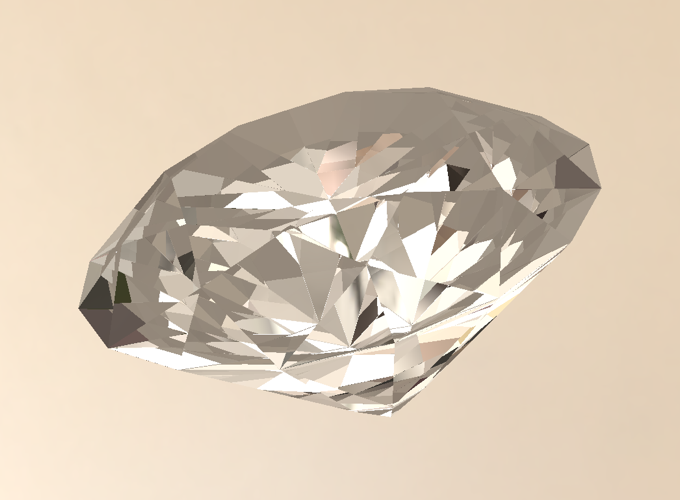
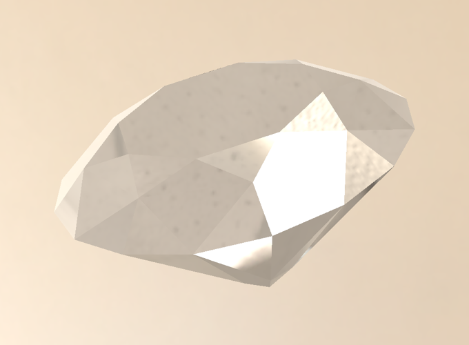
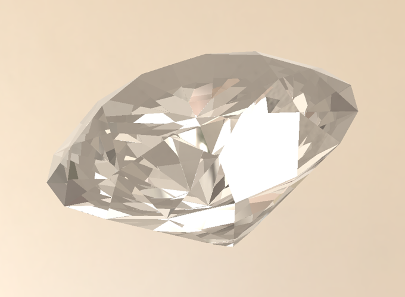
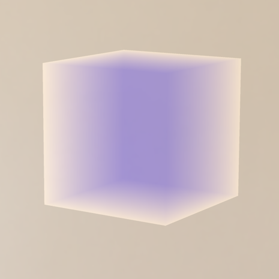
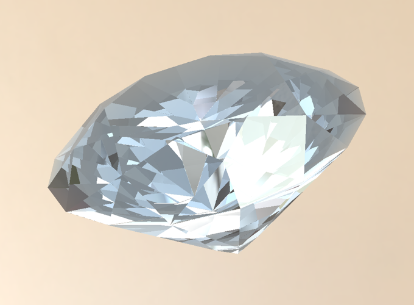
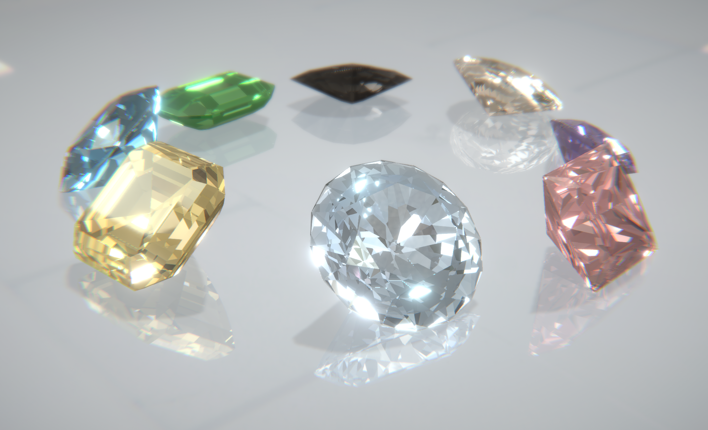

<!-- more -->

最近在学习制作宝石材质时发现了一个 Unity 宝石的插件 [R Gem Effect](https://www.youtube.com/watch?v=TnfsgGeJLXg&list=PLziuwOPTxw3tNmuBs7j3ZyCqk5P5uNB5c&index=1){:target="_blank"}，第一次看这个视频的时候就觉得很惊艳，可惜这个插件在 Unity 商店里下架了。看视频可以发现，原作者使用了光线追踪，所以就想自己在 Unity 里实现这样的效果。


*\*项目中的模型来自 R Gem Effect Unity Plugin ，HDR 环境图来自 [HDRIHaven](https://hdrihaven.com/){:target="_blank"}*

Github: [github.com/Sorumi/UnityRayTracingGem](<https://github.com/Sorumi/UnityRayTracingGem>){:target="_blank"}


##### Ray Tracing

光线追踪是指从摄像机出发的若干条光线，每条光线会和场景里的物体求交，根据交点位置获取表面的材质、纹理等信息，并结合光源信息计算光照。相对于传统的光栅化渲染，光线追踪可以轻松模拟各种光学效果，如反射、折射、散射、色散等。但由于在进行求交计算时需要知道整个场景的信息，其计算成本非常高。

关于如何在 Unity 中进行 Ray Tracing，我参考了 [GPU Ray Tracing in Unity](http://blog.three-eyed-games.com/){:target="_blank"}这个系列的文章，使用了 Compute Shader 来实现。

##### 实时渲染宝石

实时渲染不同于离线渲染，不可能在整个场景中都使用光线追踪，又由于宝石材质的特殊性，我对其进行一下几点约束 (tricks)：

1. 整个场景使用光栅化渲染流程，只有在渲染宝石物体时，使用光线追踪，在片元着色器中从摄像机放射光线。
2. 每个宝石物体在光线追踪时，只和自己的 Mesh 模型进行求交点的计算。
3. 只使用光线追踪来计算光线的折射和反射。
4. 假设宝石表面是完全光滑的，不考虑微表面，且内部无任何杂质。其表面只有 specular 项，无 diffuse 项。
5. 光线仅在第一次与宝石表面相交时，被分为反射光线和折射光线，之后折射光线在宝石的内部进行全反射或其折射出宝石表面。
6. 光线经过反射或折射，射出宝石表面后，对天空球进行采样。

由于我们在着色器中传递整个模型数据，需要使用 `ComputeBuffer`，这一般是为 Compute Shader 提供的，要在一般的顶点像素着色器中使用，需要至少支持 shader model 4.5 。在 Shader 中，`ComputeBuffer` 映射的数据类型为 `StructuredBuffer<T>` 和 `RWStructuredBuffer<T>` 。


##### 折射

通过入射光线方向、入射点法线方向、入射介质折射率、出射介质折射率来计算出射光线方向：

$$
T=\frac{\eta_{1}}{\eta_{2}}\left(I+\cos \left(\theta_{1}\right) N\right)-N \sqrt{1-\left(\frac{\eta_{1}}{\eta_{2}}\right)^{2}\left(1-\cos ^{2}\left(\theta_{1}\right)\right)}
$$

当光由光密介质射到光疏介质的界面时，会发生全反射现象，即光线全部被反射回原介质内。此时：

$$
{1-\left(\frac{\eta_{1}}{\eta_{2}}\right)^{2}\left(1-\cos ^{2}\left(\theta_{1}\right)\right)} < 0
$$

由于要考虑全反射的情况，这里我自定了 `Refract(i, n, eta, o)` 函数，返回值表示是否存在折射光线，不存在表示进行了全反射，其实现参考了 Unity 内置的 `refract(i, n, eta)` 函数。

```
float Refract(float3 i, float3 n, float eta, inout float3 o)
{
    float cosi = dot(-i, n);
    float cost2 = 1.0f - eta * eta * (1 - cosi * cosi);

    o = eta * i + ((eta * cosi - sqrt(cost2)) * n);
    return 1 - step(cost2, 0);
}
```


在和模型的三角面求交点时，折射光线会和三角面的背面相交，需要注意不能进行**背面剔除**。当光线从宝石射出时，法线需要**反向**。

```
float eta;
float3 normal;
        
// out
if (dot(ray.direction, hit.normal) > 0)
{
	normal = -hit.normal;
	eta = _IOR;
}
// in
else
{
	normal = hit.normal;
	eta = 1.0 / _IOR;
}
        
ray.origin = hit.position - normal * 0.001f;
        
float3 refractRay;
float refracted = Refract(ray.direction, normal, eta, refractRay);

……

// Refraction
if (refracted == 1.0)
	ray.direction = refractRay;
// Total Internal Reflection
else
	ray.direction = reflect(ray.direction, normal);
```


仅有折射的效果：

[{:width="400"}](../../images/post/gemshader/gem_refraction.png){:target="_blank"}


##### 反射

通过入射光线方向、入射点法线方向来计算反射光线方向：

$$
R=I-2(N \cdot I) N
$$

可以直接使用 Unity 的内置函数 `reflect(i, n)` 。

```
float3 reflect(float3 i, float3 n)
{
  return i - 2.0 * n * dot(n, i);
}
```


仅有反射的效果：

[{:width="400"}](../../images/post/gemshader/gem_reflection.png){:target="_blank"}


##### 菲涅尔

透明物体既有反射又有透射即折射。它们反射的光量与透射的光量取决于入射角。当入射角减小时，透射的光量增加。按照能量守恒的原理，反射光的量加上透射光的量必须等于入射光的总量，因此，入射角增加时，反射的光量增加。

反射光与折射光的数量可以使用菲涅尔方程来计算。这里我使用 [Schlick 的简化版本](https://link.zhihu.com/?target=https%3A//en.wikipedia.org/wiki/Schlick%2527s_approximation) 来计算 Fresnel  的值，采用了入射光线方向、入射点法线方向、入射介质折射率、出射介质折射率：

$$
\begin{aligned} 
R(\theta) &=R_{0}+\left(1-R_{0}\right)(1-\cos \theta)^{5} \\
R_{0} &=\left(\frac{n_{1}-n_{2}}{n_{1}+n_{2}}\right)^{2} 
\end{aligned}
$$

```
float FresnelSchlick(float3 normal, float3 incident, float ref_idx)
{
    float cosine = dot(-incident, normal);
    float r0 = (1 - ref_idx) / (1 + ref_idx); // ref_idx = n2/n1
    r0 = r0 * r0;
    return r0 + (1 - r0) * pow((1 - cosine), 5);
}
```

在第一次与物体表面相交时，计算 Fresnel 的值，反射量乘以 $$ F_{R} $$ ， 投射量乘以 $$1-F_{R}$$ 。

```
if (depth == 0)
{
	float3 reflectDir = reflect(ray.direction, hit.normal);
	reflectDir = normalize(reflectDir);
            
	float3 reflectProb = FresnelSchlick(normal, ray.direction, eta) * _Specular;
	specular = SampleCubemap(reflectDir) * reflectProb;
	ray.energy *= 1 - reflectProb;
}
```

使用菲涅尔融合折射和反射的效果：

[{:width="400"}](../../images/post/gemshader/gem_fresnel.png){:target="_blank"}


##### 光线吸收

折射光在透明物体内部进行传播，根据 Beer-Lambert 定律，光照射入一吸收介质表面，在通过一定厚度后，介质吸收了一部分光能，透射光的强度响应减弱，因此介质会呈现出颜色倾向。光穿过一个体积的透射比 $$ T $$ 为：

$$
T=e^{-\sigma_{a} d}
$$

这里 $$ \sigma_{a} $$ 为一个吸收系数，$$ d $$ 为光折射传播的距离。

这是具有 Beer-Lambert 定律的立方体，可吸收远距离的红色和绿色光。可以发现光线透过距离越长的部分，颜色越深。

[{:width="400"}](../../images/post/gemshader/absorption.png){:target="_blank"}


要应用 Beer-Lambert  定律，您首先要计算射线穿过吸收介质的距离，在 `Ray` 中增加变量 `absorbDistance`  ：

```
struct Ray
{
    float3 origin;
    float3 direction;
    float3 energy;
    float absorbDistance;
};
```

在 `Shade` 函数中对累加计算：

```
float3 Shade(inout Ray ray, RayHit hit, int depth)
{
	if (hit.distance < 1.#INF && depth < (_TraceCount - 1))
    {
		……
		if (depth != 0)
         	ray.absorbDistance += hit.distance;
		……
	}
}
```

最后在计算颜色时根据吸收率和穿过距离计算透射比，吸收率一般为一个颜色值，描述了每个颜色通道在远处吸收的数量，为了使材质调整起来更加直观，这里对 `_Color` 值进行取反，与 `_AbsorbIntensity` 相乘，表示吸收率。

```
float3 Shade(inout Ray ray, RayHit hit, int depth)
{
	if (hit.distance < 1.#INF && depth < (_TraceCount - 1))
    {
    	……
    }
    else
    {
    	ray.energy = 0.0f;

        float3 cubeColor = SampleCubemap(ray.direction);
        float3 absorbColor = float3(1.0, 1.0, 1.0) - _Color;
        float3 absorb = exp(-absorbColor * ray.absorbDistance * _AbsorbIntensity);

        return cubeColor * absorb * _ColorMultiply + _Color * _ColorAdd;
    }
}
```

增加光线吸收的效果：

[{:width="400"}](../../images/post/gemshader/gem_absorption.png){:target="_blank"}


##### 最终效果

[](../../images/post/gemshader/render.png){:target="_blank"}

 <video class="video" src="../../videos/unitygemshader.mp4" controls></video>

##### 扩展阅读

[“Cheap” Diamond Rendering](https://medium.com/@bmind/cheap-diamond-rendering-e71203292674){:target="_blank"}

这篇文章中通过烘焙模型内部的法线贴图为 Cubemap，来模拟 RayTracing，速度更快。但这种方法仍然有点费，每个像素点最多要进行 7 次 Cubemap 采样。而且在法线转折处会有明显的锯齿，虽然能通过提高 Cubemap 的精度来改善，但不能完全消除。

##### 参考

[GPU Ray Tracing in Unity](http://blog.three-eyed-games.com/){:target="_blank"}

[Ray Tracing in One Weekend](http://www.realtimerendering.com/raytracing/Ray%20Tracing%20in%20a%20Weekend.pdf){:target="_blank"}

[Triangle Intersection](http://fileadmin.cs.lth.se/cs/Personal/Tomas_Akenine-Moller/pubs/raytri_tam.pdf){:target="_blank"}

[Reflection, Refraction and Fresnel](https://www.scratchapixel.com/lessons/3d-basic-rendering/introduction-to-shading/reflection-refraction-fresnel){:target="_blank"}

[Raytracing Reflection, Refraction, Fresnel, Total Internal Reflection, and Beer’s Law](https://blog.demofox.org/2017/01/09/raytracing-reflection-refraction-fresnel-total-internal-reflection-and-beers-law/){:target="_blank"}

[Microfacet models for refraction through rough surfaces.](https://www.cs.cornell.edu/~srm/publications/EGSR07-btdf.pdf){:target="_blank"}

[Extending the Disney BRDF to a BSDF with Integrated Subsurface Scattering](https://blog.selfshadow.com/publications/s2015-shading-course/burley/s2015_pbs_disney_bsdf_notes.pdf){:target="_blank"}