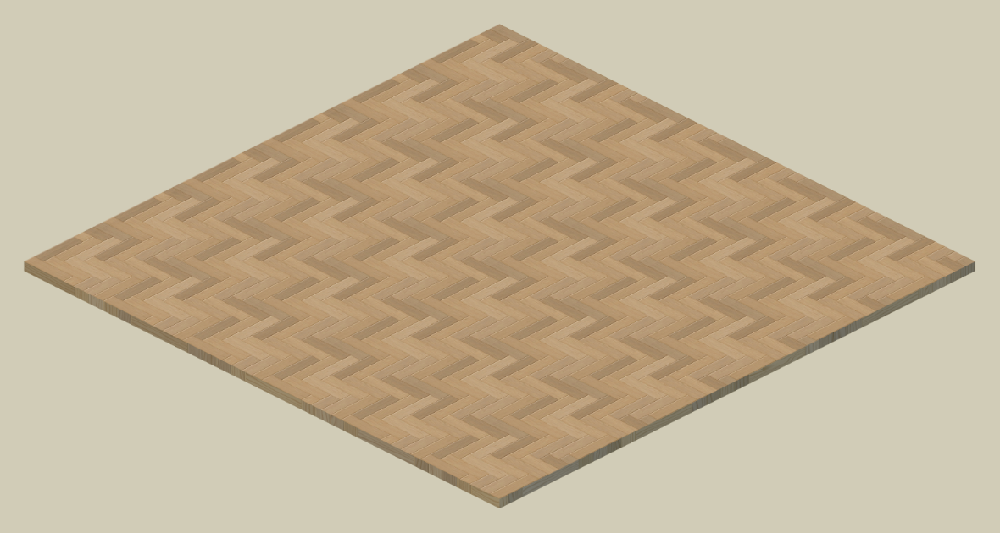

块状规则图案去除重复感方式


<!-- more -->

<blockquote class="twitter-tweet"><p lang="en" dir="ltr">Random tiling floor shader!<a href="https://twitter.com/hashtag/unity3d?src=hash&amp;ref_src=twsrc%5Etfw">#unity3d</a> <a href="https://t.co/ib7w09DdVF">pic.twitter.com/ib7w09DdVF</a></p>&mdash; Sorumi (@sorumi33) <a href="https://twitter.com/sorumi33/status/1543953380027969538?ref_src=twsrc%5Etfw">July 4, 2022</a></blockquote> <script async src="https://platform.twitter.com/widgets.js" charset="utf-8"></script>


对于地板地砖这种 Tiling 图案，图案较小时，大面积使用很容易出现重复感；图案较大时为了不重复又会需要较大的贴图尺寸。




怎样实现既有丰富变化并且又不使用高分辨率的贴图？这里提供一种解决这个问题思路，应该适用于大部分的规则图案。


##### 贴图拆分
首先将规则图案和细节纹理拆分，规则图案可将法线和AO合并成一张贴图，细节纹理贴图需要是四方连续的。


{:width="400"}

之后用原 uv 采样规则图案贴图，为每个块重建 uv，用于细节纹理贴图进行采样。并保证每一块的 uv 的差异化，来模拟花纹的随机感。


##### 用于旋转的方向图
例如下面这样的图案，不是所有块的方向是一致的，对于这种情况，需要一张贴图表示 uv 的旋转。

{:width="400"}

二维旋转公式：

$$
\left(\begin{array}{l}
x^{\prime} \\
y^{\prime}
\end{array}\right)=\left(\begin{array}{cc}
\cos \theta & -\sin \theta \\
\sin \theta & \cos \theta
\end{array}\right)\left(\begin{array}{l}
x \\
y
\end{array}\right)
$$

计算所需要的参数 $$\sin \theta$$ 和 $$\cos \theta$$ 的范围都是 $$[-1, 1]$$ ，将其映射到 $$[0, 1]$$ 后，制作成 2 通道的贴图。

{:width="400"}

在 Shader 中，将采样该贴图的数值重新映射，构成旋转矩阵，与原 uv 相乘即得到旋转后的 uv。

{:width="400"}


在旋转 uv 后，下图（1）已经实现了不同的采样 uv，（2）中方向一致的相邻块的图案依旧连续的。且对于本身方向就一致的图案（3），根本不需要方向图来改变 uv。针对这种情况，对 uv 进行偏移和翻转。

{:width="400"}

{:width="400"}


##### 偏移与翻转

uv 是 2 维向量，如果要同时偏移和翻转，需要 4 个值，其中偏移是取值 $[0,1]$，翻转只用 0 和 1 来表示需不需要在该方向翻转。这样可以将 4 个数合并成 2 个数，存到 2 通道的图中。

$$
Color_{u} = Flip_{u} + Offset_{u} * 0.5
$$

单通道用随机灰度图即可

{:width="400"}

Shader 中采样贴图后的代码：

```
uv = lerp(half2(1, 1) - uv, uv, step(tex, half2(0.5, 0.5)));
uv += frac(offset * 2);
```

进行偏移翻转后的效果如图，基本上很难找到相同的两块了。

{:width="400"}

由于偏移和翻转也是 Tiling 的贴图，当规则图案的 Tiling 数和细节纹理的 Tiling 数存在倍数关系时，还是会有重复的图案出现。要实现真正的每个块随机偏移，就要生成随机数，具体实现方法放在下一篇啦。
