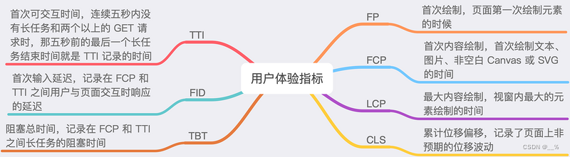

<!-- more -->

### 1.埋点：

基于我们要监控的内容，可以分为：**数据监控、性能监控、异常监控**等三个部分

#### 1.1 数据监控

数据监控主要指对用户行为、业务数据等进行埋点监控，采集并上报关键信息。目的通过收集用户在系统中的行为数据，帮助产品经理、运营人员更好地分析用户行为，优化产品决策

- 用户操作数据：点击某个按钮、页面的浏览路径、搜索的关键词、用户停留时间等。
- 电商平台：监控用户的商品浏览记录、加入购物车、购买行为、支付情况等数据。
- 社交平台：记录用户点赞、评论、分享、发布动态等操作。

**例如**，在一个电商网站中，当用户点击了“购买”按钮，系统会埋点记录这次点击事件，包括**用户 ID、商品 ID、点击事件**等，都会被上报到服务器，用于分析转化率、购物路径优化等

- 埋点的作用：
    - 数据量大，覆盖面广，有利于全面掌握用户的操作行为
    - 为业务决策提供有力的数据支持，帮助进行 AB 实验、用户行为分析等
- 不足：
    - 数据量大时，可能增加数据处理和存储的成本
    - 埋点较多时，可能影响页面性能
    - 埋点的开发维护成本会偏高

#### 1.2 性能监控

性能监控关注的是系统性能的表现，重点监控页面的加载时间、渲染时间、资源请求时间。

目的是帮助开发者了解项目的性能数据，为性能优化做导向

**例如，**监控页面从开始加载到完全展示各阶段的时间，如 **FP、FCP、LCP、JS 初始化、主接口加载**等

- 埋点的作用：
    - 及时发现性能瓶颈，提升用户体验，降低用户流失率
    - 可以通过历史数据跟踪性能优化效果，确保持续优化
- 不足：
    - 采集的部分性能指标（如**两秒开率**等）可能需要与服务端结合，增加开发复杂度
1. FP (First Paint): 第一次绘制，指的是浏览器将像素渲染到屏幕上的时间点。
2. FCP (First Contentful Paint): 第一次内容绘制，指的是浏览器渲染任何文本、图片、Canvas或SVG的时间点。
3. LCP (Largest Contentful Paint): 最大内容绘制，指的是页面主要内容（如图片或文本块）完成渲染的时间点。
4. JS 初始化: 指的是主要JavaScript文件加载和执行完毕的时间点。
5. 主接口加载: 指的是整个页面加载完毕的时间点，包括所有依赖资源的加载。



#### 1.3 异常监控

异常监控主要用于捕获系统中的异常情况，包括 JavaScript 错误、接口请求失败、未处理的 Promise 错误、资源加载失败等，目的是通过及时捕获并上报异常信息，帮助开发者迅速定位问题、解决问题

**例如，**

1. **JavaScript 错误**：捕获页面中运行时的 JavaScript 错误，如未定义变量。**例如，当我访问某个页面时，某个 JavaScript 模块发生了错误，导致页面无法正常展示，异常监控会将错误信息、错误堆栈、用户操作**等信息记录并上报
2. **接口请求失败**：监控 API 请求的**状态码、超时情况**等，如**请求返回 500 错误或出现网络超时**等问题
3. **资源加载失败**：监控页面中**图片、视频、CSS、JS 文件的加载失败情况**，**帮助开发者检查资源引用路径或网络问题**
- 埋点的作用：
    - 实时捕获异常，帮助开发者迅速发现并修复问题，提高用户体验
    - 能够自动化捕获大量错误信息，减少手动调试的压力
- 不足：
    - 捕获到的异常信息可能过多，数据筛选和处理的难度较高
    - 需要额外的策略来区分重要异常和无关紧要的异常，以避免过多无效的报警

### 2.上报方式

#### 2.1 手动上报：

**手动上报是指我们基于业务需求，在代码中显式地添加埋点逻辑**

每当需要记录用户行为或系统事件时，手动调用上报函数，将数据发送至服务器，这种方式的可控性强，开发者可以精确地控制埋点位置和上报时机

**举例：**

- 在用户点击某个按钮时，开发者会在按钮的点击事件中调用埋点上报函数，如：

```jsx
button.addEventListener('click', () => {
    sendEvent('click_button', { userId: '12345', time: Date.now() });
});
```

这种方式能够精确记录用户点击的时间、操作对象等详细信息。

- **页面展示**：在页面加载完成时，埋点记录页面的展示情况

```jsx
window.addEventListener('load', () => {
    sendEvent('page_view', { page: 'homepage', time: Date.now() });
});
```

- **组件 DOM 超出 50% 曝光**：使用 `IntersectionObserver` API 监测页面上特定组件的可见性，当组件的可见部分超过 50% 时，自动上报组件的曝光情况

```jsx

const observer = new IntersectionObserver((entries) => {
    entries.forEach(entry => {
        if (entry.isIntersecting && entry.intersectionRatio > 0.5) {
            sendEvent('component_exposure', { component: 'banner', time: Date.now() });
        
    });
}, {
    threshold: [0.5] // 超过50%可见时触发});

const component = document.querySelector('#banner');
observer.observe(component);
```

- **优点**：
    - 高度灵活，开发者可以精确控制上报时机、数据内容等
    - 适合复杂业务场景或需要精确控制的埋点需求
- **缺点**：
    - 需要手动编写大量代码，增加了开发和维护成本
    - 如果埋点较多，容易遗漏或出现冗余埋点，影响代码质量，甚至导致**数据不置信**

#### 2.2 可视化上报：

可视化上报是通过图形界面或后台工具来配置埋点，无需开发人员手动编写代码。在业务人员或测试人员通过可视化工具对页面上的元素（如按钮、链接等）进行选择和配置后，系统自动生成埋点逻辑并上报数据。这种方式降低了技术门槛，使非开发人员也能够参与埋点配置

- **优点**：
    - 减少了开发者的工作量，业务人员可以快速配置埋点
    - 埋点配置灵活，可以根据需要随时调整，无需发布新的代码
- **缺点**：
    - 灵活性不如手动上报，复杂的业务逻辑可能无法通过可视化工具实现
    - 依赖第三方工具，可能带来兼容性或平台限制的问题

**举例：**

- 使用一些埋点平台（如 GrowingIO、神策数据等），业务人员可以在后台系统的可视化界面上点击页面元素，配置该元素的埋点逻辑。系统会自动捕获该元素的操作，并将数据上报至服务器

#### 2.3 自动上报（无埋点）

**特点：**

自动上报（无埋点）是指**系统通过框架或插件自动捕获**用户行为或系统事件，无需手动埋点

**举例：**

- 使用无埋点方案时，项目初始化阶段会注册相关的监听，这种方式依赖于 SDK 的能力，自动监听页面上的交互事件、网络请求、资源加载等，并将数据上报到后台进行分析
- **优点**：
    - 减少了开发和运维成本，开发人员无需为每个事件手动编写埋点逻辑
- **缺点**：
    - 灵活性较低，自动捕获的行为数据可能无法满足某些特定业务需求，且不容易精确控制上报的内容和时机

### 3. 埋点的生命周期


再精确到**研发主要负责的范围**，我们可以给出一个更精细化的图：


虽然该流程覆盖了埋点从需求确认到数据消费的各个步骤，但在需求确认、开发自测、数据监控等环节可能存在**数据遗漏、埋点不准确、数据质量监控不足**等问题：

- **需求确认与埋点设计环节容易遗漏场景**：埋点需求的确认和埋点方案设计环节，产品经理对用户行为理解不全面，或者开发人员没有参与设计环节，可能会遗漏一些关键场景或不常见的边缘操作
- **开发和自测环节容易出现数据不一致**：在埋点开发和自测阶段，开发人员可能会因为疏忽或理解偏差，导致埋点的事件数据与需求不符。例如，埋点位置不准确、上报参数不完整、或埋点上报的时间点不对
- **埋点对性能的影响未充分考虑**：如果埋点过多或者不合理设置上报频率，可能会导致页面性能下降，例如页面加载变慢、用户操作卡顿等问题，影响用户体验

**类型代码约束**

通过 `Typescript` 为埋点的上报提供类型约束：

尽可能避免埋点过程中出现**数据格式、字段不一致**等问题

了解了收益后，我们再来学习一下**类型代码的消费方式**，以及一个**合理的类型代码结构**

一套最基本的埋点上报函数的封装（sendEvent）：

```python
export const sendEvent = <T extends EventNames>(  event: T,
  params?: TrackInterfaces[T]
) => {
  // 埋点上传};

export interface TrackInterfaces {
  main_picture_click: MainPictureClick;
  page_view: PageView;
}

export type EventNames = "main_picture_click" | "page_view";

/** * 页面浏览
 */
export interface PageView {
  /**   * 应用名称
   */
  appName: string;
  /**   * 平台
   */
  device_platform: string;
  /**   * 来源
   */
  enter_from: string;
  /**   * 链接
   */
  page_url: string;
  /**   * 页面名称
   */
  page_name: string;
}
```

可以看到我们通过一个枚举类型，维护了项目所有包含的类型名称，通过 `T extends EventNames` 获取了函数中具体的事件名，再通过 `TrackInterfaces` 映射到了具体的一个类型，比如：

**埋点测试用例**

测试用例可以用很多种方式进行，比如**单元测试、抓包测试**等，其中单元测试可以通过如 `Jest` 或 `Mocha` 实现，存在一定 coding 成本，我们这边展开讲讲抓包测试的实现方式

最简单粗暴的，我们可以使用**浏览器开发者工具**、[**Charles**](https://link.juejin.cn/?target=https%3A%2F%2Fwww.charlesproxy.com%2F) 等工具，捕获网页上的网络请求，观察上报的参数是否符合埋点事件的要求

然而这样的方式比较笨，批量检查起来会比较麻烦，因此一般的埋点管理平台会提供一个界面，能够实时显示埋点上报的具体内容，类似于抓包工具，可以有效地提高测试阶段的效率与准确率


#### 3. 性能优化